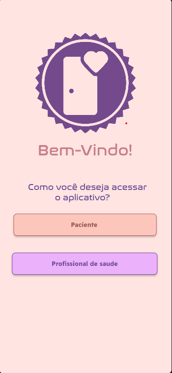
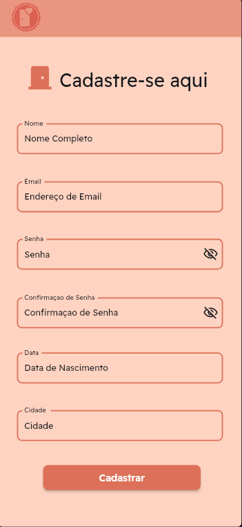
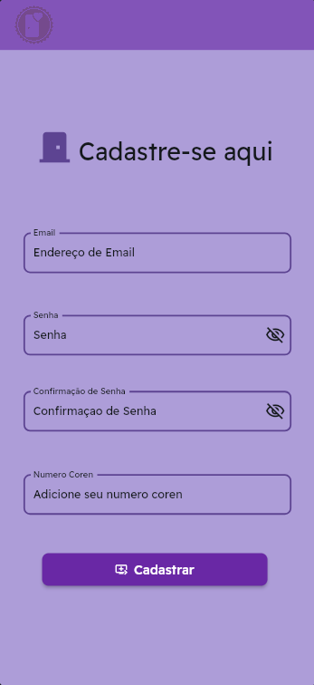
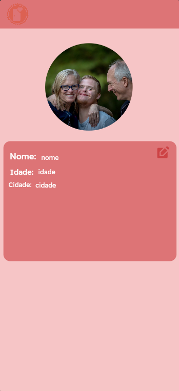
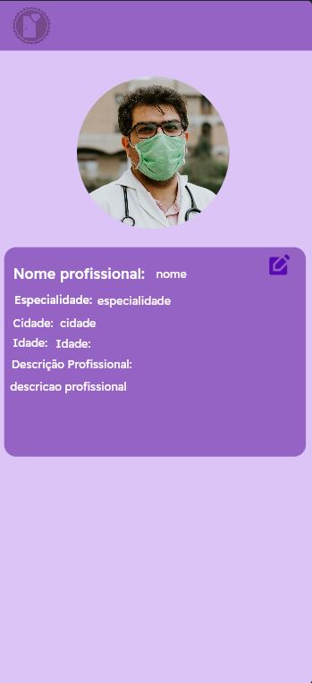

<!--
**SaudenaPorta/SaudenaPorta** is a ✨ _special_ ✨ repository because its `README.md` (this file) appears on your GitHub profile.
-->

## Saúde na Porta 🚑

O *Saúde na Porta* é uma plataforma para conectar pacientes com serviços de saúde acessíveis e eficientes diretamente em sua localização. 💜🧡

## Principais Telas

### Tela Principal

### Tela de Cadastro de Paciente

### Tela de Cadastro de Profissionais da Saúde

### Tela de Perfil de Paciente

### Tela de Perfil de Profissionais da Saúde

## Público-Alvo 🎯

O **Saúde na Porta** foi pensado para atender diferentes grupos, incluindo:

- **Pessoas que moram sozinhas**: Facilita o acesso a serviços de saúde de maneira prática e rápida, sem precisar sair de casa.
- **Pacientes em geral**: Oferece uma solução para agendar consultas e receber atendimentos personalizados.
- **Profissionais da Saúde**: Conecta profissionais a pacientes próximos, ajudando-os a expandir seu alcance e oferecer serviços sob demanda.

## Funcionalidades 🚀

O **Saúde na Porta** oferece diversas funcionalidades para facilitar a interação entre pacientes e profissionais da saúde:

- **Conexão Fácil entre Pacientes e Profissionais**  
  Permite que os pacientes encontrem e entrem em contato com profissionais da saúde de maneira rápida e prática.

- **Acesso Simplificado para Profissionais**  
  Os profissionais da saúde podem facilmente se conectar com pacientes, oferecendo seus serviços de forma eficiente e acessível.

- **Gerenciamento de Atendimentos** 
  Histórico de consultas e atendimentos para pacientes e profissionais acompanharem os serviços realizados.

- **Notificações e Lembretes** 
  Notifica pacientes sobre consultas agendadas e lembretes importantes.

  ## Funcionamento ⚙️

O **Saúde na Porta** funciona de maneira simples e intuitiva para atender diferentes perfis de usuários. Confira como cada tipo de usuário pode utilizar o sistema:

### Pacientes 🩺
1. **Cadastro e Login**:  
   - O paciente deve criar uma conta fornecendo informações básicas, como nome, e-mail e endereço.
   - Após o cadastro, o login é necessário para acessar as funcionalidades.

2. **Utilização**:  
   - Pesquisar por profissionais de saúde próximos à sua localização.  
   - **Publicar solicitações de atendimento**:  
     - O paciente pode criar um post descrevendo suas necessidades (ex.: "Preciso de um clínico geral para consulta domiciliar").  
     - Os profissionais visualizam essas publicações e podem responder diretamente no sistema.  
   - Entrar em contato com os profissionais via chat ou agendar consultas diretamente.  
   - Visualizar o histórico de atendimentos e acompanhar futuras consultas.

---

### Profissionais da Saúde 👩‍⚕️👨‍⚕️
1. **Cadastro e Login**:  
   - Os profissionais devem criar uma conta informando dados como nome, especialidade, registro profissional e área de atuação.

2. **Utilização**:  
   - Visualizar as **solicitações de atendimento publicadas pelos pacientes** e entrar em contato com eles.  
   - Receber solicitações diretas de atendimento dos pacientes próximos.  
   - Gerenciar os atendimentos realizados e organizar a agenda.  
   - Atualizar informações sobre sua disponibilidade e especialidade no perfil.

---

### Requisitos para Todos os Usuários
- **Conexão com a Internet**: O sistema é acessado online.  
- **Dispositivo Compatível**: Pode ser usado em computadores, tablets ou smartphones.  
- **Credenciais de Acesso**: E-mail e senha cadastrados são necessários para login.

---

Com esse fluxo, o sistema facilita a comunicação e o agendamento entre pacientes e profissionais. 🚑💜🧡

## Tecnologias Utilizadas 💻

- **Flutter Flow**:  
  Usado para criar a interface e as funcionalidades do sistema de maneira visual e intuitiva. O Flutter Flow permite o desenvolvimento rápido de aplicativos, com recursos de navegação, integração com APIs, e criação de lógica de negócios sem a necessidade de escrever código manualmente.

- **Firebase**:  
  Plataforma de desenvolvimento da Google que fornece uma série de serviços backend, como banco de dados em tempo real, autenticação de usuários, armazenamento de arquivos, notificações push e hospedagem. O Firebase facilita a criação e manutenção do sistema, oferecendo escalabilidade e integração fácil com o Flutter Flow.

## Equipe 👥

- **Lara**:  
  Responsável pelo desenvolvimento do **Front End**. Criou a interface do usuário e implementou as interações no sistema, utilizando o Flutter Flow para garantir uma experiência fluida e responsiva.

- **Mayara**:  
  Responsável pelo **Back End**. Desenvolveu a lógica do servidor, APIs e integração com o banco de dados, garantindo que o sistema funcione corretamente entre o front e o banco de dados.

- **Milena**:  
  Responsável pelo **Banco de Dados**. Trabalhou na configuração e gestão do banco de dados Firebase, garantindo que os dados dos usuários e transações fossem armazenados de forma segura e eficiente.

